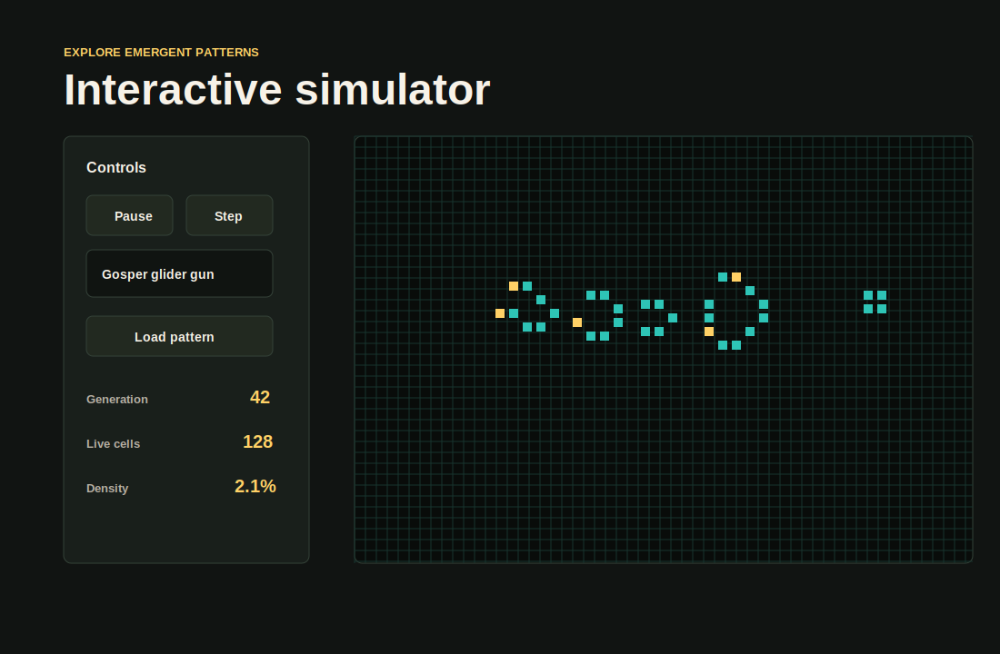

# Conway's Game of Life

Self-contained web simulator for Conway's Game of Life, written with HTML, CSS, and JavaScript without external dependencies.

## Suggested repository name

`conway-game-of-life`

## How to open it

Play the published version here: https://nonoxz.github.io/conway-game-of-life/

Open `index.html` in a browser. You can publish it directly with GitHub Pages because it does not require a server or build step.

## Features

- Canvas simulation of the B3/S23 cellular automaton.
- English default interface with language options for Spanish and Portuguese.
- Controls to start, pause, step, clear, and generate random seeds.
- Classic patterns: glider, blinker, pulsar, R-pentomino, Acorn, and Gosper glider gun.
- Pointer editing on the board.
- Sections with rules, history, and research links.

## Publish with GitHub Pages

1. Create a repository on GitHub.
2. Upload `index.html`, `styles.css`, `app.js`, `LICENSE`, `assets/screenshot.svg`, and this `README.md`.
3. In GitHub, open `Settings > Pages`.
4. Choose the main branch and root folder.
5. Save the configuration and wait for GitHub to provide the public URL.

## License

This project is distributed under the MIT License. See `LICENSE` for details.

## Included references

- LifeWiki: https://conwaylife.com/wiki/Conway%27s_Game_of_Life
- Scholarpedia: https://www.scholarpedia.org/article/Game_of_Life
- J.-P. Rennard, Implementation of Logical Functions in the Game of Life: https://arxiv.org/abs/cs/0406009
- Conway's Game of Life is Omniperiodic: https://arxiv.org/abs/2312.02799
- Conway's game of life is a near-critical metastable state: https://arxiv.org/abs/1407.1006
- GOL in GOL in HOL: https://arxiv.org/abs/2504.00263
